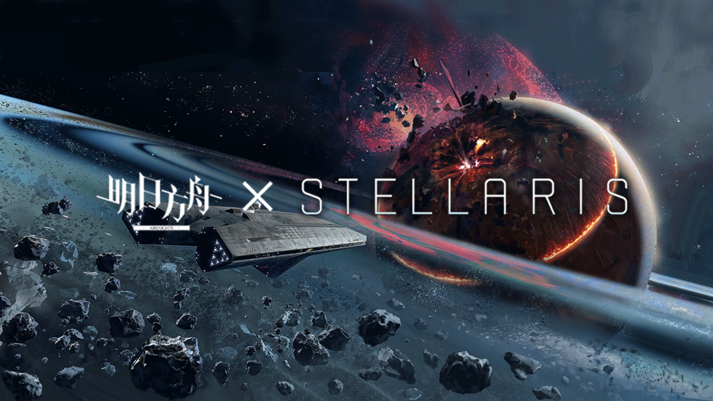

# 明日方舟 Stellaris Mod | Arknights Stellaris Mod

> 🚧 **开发中** | **Work in Progress** 🚧  
> 将明日方舟的世界观带入群星，体验泰拉大陆的源石文明！  
> *Bringing the world of Arknights to Stellaris - Experience the Originium civilization of Terra!*

---

## ⚠️ 重要提醒 | Important Notice

- **本mod目前缺少充分测试，如果游戏闪退很可能是mod的问题**
- **This mod lacks sufficient testing. Game crashes are likely caused by mod issues**
- 请及时备份存档 | Please backup your saves regularly

---

## 🌟 核心特色 | Core Features

### 🧬 种族 | Species System
- **泰拉种族** | Terra Species (统称，不细分黎博利、佩洛等)
- **源石适应性** | Originium Adaptability traits

### 🎯 特质 | Traits System
- 泰拉物种专属源石适应性
- 配套的正面和负面效果
- 源石技艺相关特质

### 🌸 传统 | Traditions
- 参考格式塔意识和合成繁衍机制
- 多阶段发展路径

### ⚡ 天灾 | Catastrophes
> *"报告普瑞赛斯，今天也在认真执行源石计划！"*
- 初期类似宇宙起源事件
- 后期需要建造五个光环并积累足够源石

### 🏗️ 建筑系统 | Buildings
- 罗德岛基建设施
- 各类办事处

### 📜 法令系统 | Edicts
- 抽卡机制的核心
- 源石技艺过载与尸体回收

### 🚀 舰船组件 | Ship Components
> *"堕落帝国的舰船真的很合我的XP..."*

### 💎 新资源 | New Resources
- **源石** | Originium
- **矿石病抑制剂** | Oripathy Suppressants

### 👑 领袖系统 | Leaders
- 干员作为事件领袖（类似凯德斯）
- 独特的命定特质
- 特殊技能和效果

---

## 🗓️ 开发进度图 | Development Roadmap

| 功能 | 状态 | 进度  |
|------|------|-----|
| 种族系统 | ✅ 完成 | 90% |
| 特质系统 | 🔄 开发中 | 90% |
| 传统系统 | ✅ 完成 | 90% |
| 天灾系统 | ✅ 完成 | 90% |
| 建筑系统 | 🔄 开发中 | 40% |
| 抽卡系统 | ✅ 基本完成 | 90% |
| 领袖系统 | 🔄 开发中 | 90% |

---

## 🔧 兼容性说明 | Compatibility

### ✅ 兼容的Mod | Compatible Mods
- UI类mod | UI mods
- 舰船类mod | Ship mods
- 物种类mod | Species mods
- 立绘/肖像mod | Portrait mods

### ❌ 可能不兼容 | Potentially Incompatible
由于本mod重载了原版的部分内容以确保兼容性，以下类型的mod可能产生冲突：
- 修改官方岗位的mod | Mods that modify vanilla jobs
- 修改官方建筑的mod | Mods that modify vanilla buildings
- 修改官方特质的mod | Mods that modify vanilla traits

---

## 📋 更新日志 | Update Log

### 🎯 **2025.8.29** - 新天灾飞升完成

- ✨ 基本完成天灾飞升的所有效果和事件
- 新的飞升路线、巨构、科技、修正、事件、胜利方式
- 🖼️ 添加了新的图片资源

*Completed all effects and events for Originium Ascension path, overrode vanilla traits for compatibility, added new images,crisis path, megastructure, tech, modifier, event, new way of winning the game.*

### 🎯 **2025.8.8** - 源石飞升完成

- ✨ 基本完成源石飞升的所有效果和事件
- 🔄 重载原版特质以适配新飞升机制
- 🖼️ 添加了新的图片资源

*Completed all effects and events for Originium Ascension path, overrode vanilla traits for compatibility, added new images*

### 🚀 **2025.8.6** - 飞升框架实现

- 🏗️ 源石飞升框架基本实现
- ⚙️ 传统树效果仍在开发中
- 📊 抑制剂产量机制需要调整

*Originium Ascension framework implemented, tradition tree effects still in development*

### 🔧 **2025.8.1** - 自动改造系统

- 🤖 实现源石技艺版自动改造特质
- ⚗️ 工匠现在产出矿石病抑制剂
- ⛏️ 矿工产出少量源石供前期使用
- 🔄 所有源石技艺特质需要抑制剂维护

*Implemented Originium Arts auto-modification traits, artisans now produce suppressants*

### 💎 **2025.7.29** - 源石生产系统

- ⛏️ 实现源石生产机制（类似纳米机器人）
- 🔓 暂无前置科技要求

*Implemented Originium production system similar to nanobots*

### 🖼️ **2025.7.24** - 立绘系统优化

- 📐 修改干员立绘尺寸和设置逻辑
- 🔧 解决立绘重叠和超出边界问题

*Fixed operator portrait sizing and logic issues*

### 🎲 **2025.7.22** - 抽卡机制完善

- 🎯 完善抽卡机制，更新五星干员逻辑
- 🖼️ 导入部分干员立绘
- 🔄 手动处理立绘资源

*Improved gacha mechanics and updated 5-star operator logic*

### 🎮 **2025.7.20** - 基础抽卡系统

- 🎲 增加初级抽卡机制
- 👥 干员特质和立绘系统初步可玩

*Added basic gacha system with initial playability*

---

## 🎨 技术说明 | Technical Notes

### 开发挑战
- 美术技术力不足，立绘处理需要手动完成
- 各项内容的具体设计仍在完善中
- 项目整体进展相对缓慢

### 设计理念
- 尽可能保持与原版游戏的平衡性
- 忠实还原明日方舟的世界观和设定
- 提供独特而有趣的游戏体验

---

## 🤝 贡献与反馈 | Contributing & Feedback

欢迎提供建议、报告bug或贡献代码！  
*Suggestions, bug reports, and code contributions are welcomed!*

### 已知问题
- 部分特质效果仍需平衡性调整
- 事件文案可能与情景不适配
---

## 📞 联系方式 | Contact

- 反馈问题请通过 [Issues](链接) 页面
- 讨论和建议请访问 [论坛](链接)

---

## 📄 许可证 | License

- 本mod大部分素材来自鹰角网络,少数图标为自行绘制。禁止商用
- [CC BY-NC 4.0]
  https://creativecommons.org/licenses/by-nc/4.0/

---

**🌟 感谢你的关注！| Thank you for your interest! 🌟**

*让我们一起在群星中重建泰拉！*  
*Let's rebuild Terra among the stars!*

